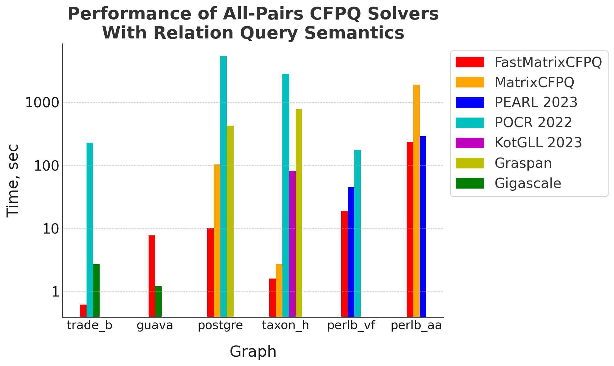

## CFPQ_PyAlgo

The CFPQ_PyAlgo is a repository for developing, testing and evaluating solvers for
Formal-Language-Constrained Path Problems, such as Context-Free Path Queries (CFPQ) and Regular Path Queries (RPQ).

All algorithms are based on the [GraphBLAS](http://graphblas.org) framework that allows to represent graphs as matrices
and work with them in terms of linear algebra.

## Installation

For the installation instructions, refer to [docs/install.md](docs/install.md).  

## CLI
The CFPQ_PyAlgo project includes a command line interface for running 
all-pairs CFPQ solver with relation query semantics.

For more details, refer to [docs/cli.md](docs/cli.md).  

## Evaluation

The CFPQ_PyAlgo project includes a [CFPQ evaluator](cfpq_eval) tool for evaluating the performance 
of various CFPQ solvers.

For more details on [CFPQ evaluator](cfpq_eval) usage, refer to [docs/eval.md](docs/eval.md).

We used the [CFPQ evaluator](cfpq_eval) to compare our solver, FastMatrixCFPQ, with five 
state-of-the-art competitors:
[PEARL](https://figshare.com/articles/dataset/ASE_2023_artifact/23702271),
[POCR](https://github.com/kisslune/POCR),
[KotGLL](https://github.com/vadyushkins/kotgll),
[Graspan](https://github.com/Graspan/Graspan-C), and
[Gigascale](https://bitbucket.org/jensdietrich/gigascale-pointsto-oopsla2015/src),
as well as with the previous version of our solver, MatrixCFPQ. 
The input data was provided by the
[CFPQ_Data](https://github.com/FormalLanguageConstrainedPathQuerying/CFPQ_Data),
[CFPQ_JavaGraphMiner](https://github.com/FormalLanguageConstrainedPathQuerying/CFPQ_JavaGraphMiner), and
[CPU17-graphs](https://github.com/kisslune/CPU17-graphs)
projects and is included in the [CFPQ evaluator distribution](docs/eval_install.md). 
We ran the evaluation five times on a Ryzen 9 7900X CPU with 128 GB of DDR5 RAM, 
with a timeout of 10,000 seconds for each solver invocation.

As shown in the bar chart below, FastMatrixCFPQ consistently outperforms other universal solvers
but is sometimes slower than the specialized solver
[Gigascale](https://bitbucket.org/jensdietrich/gigascale-pointsto-oopsla2015/src),
which is optimized for one specific context-free grammar.
Therefore, generalizing the ideas of [Gigascale](https://bitbucket.org/jensdietrich/gigascale-pointsto-oopsla2015/src) (i.e., recognizing and exploiting answer patterns) 
is one of our future research directions.



## Project structure
The global project structure is the following.

```
├── cfpq_algo - FastMatrixCFPQ and MatrixCFPQ algorithms implementations
├── cfpq_cli - scripts for running CFPQ algorithms
├── cfpq_eval - scripts for evaluating performance of various CFPQ solvers (icluding third-party ones)
├── cfpq_matrix - matrix wrappers that improve performance of operations with matrices
├── cfpq_model - graph & grammar representations
├── deps
│   └── CFPQ_Data - repository with graphs and grammars suites
├── benchmark - directory for performance measurements of legacy CFPQ implementations
├── src - legacy CFPQ implementations
└── test - tests
```
